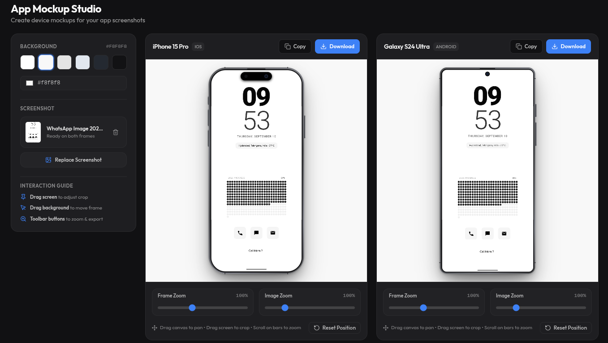

## Clone & install dependencies
```bash
git clone https://github.com/localhost969/app-mock-studio.git
cd app-mock-studio
npm install
```


## Run

```bash
npm run dev
```

Open [http://localhost:3000](http://localhost:3000) with your browser to see the website.
